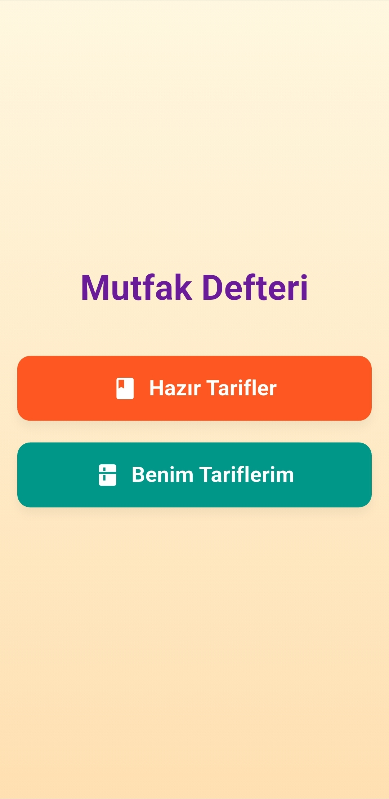
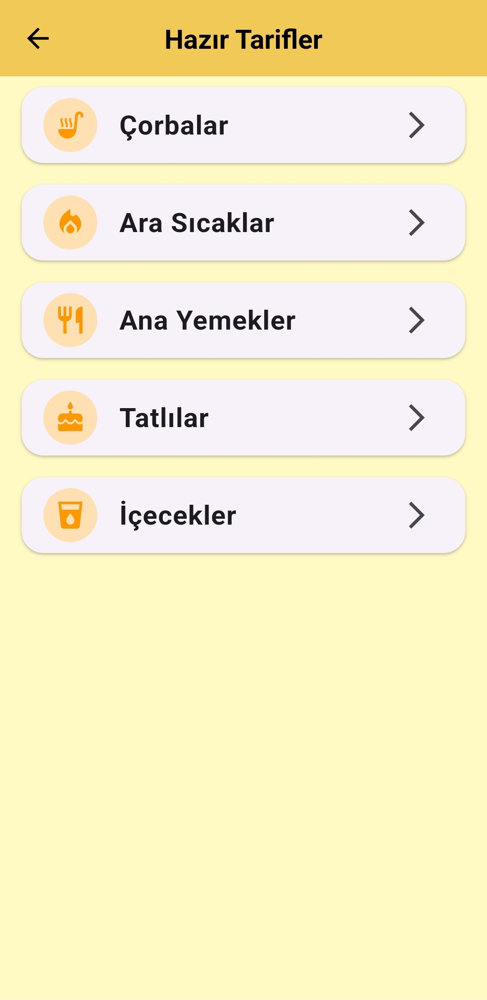
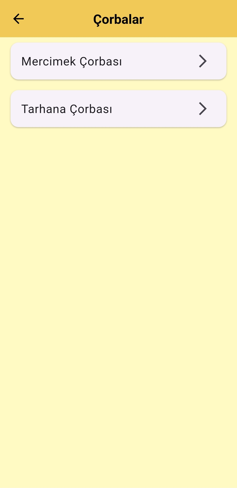
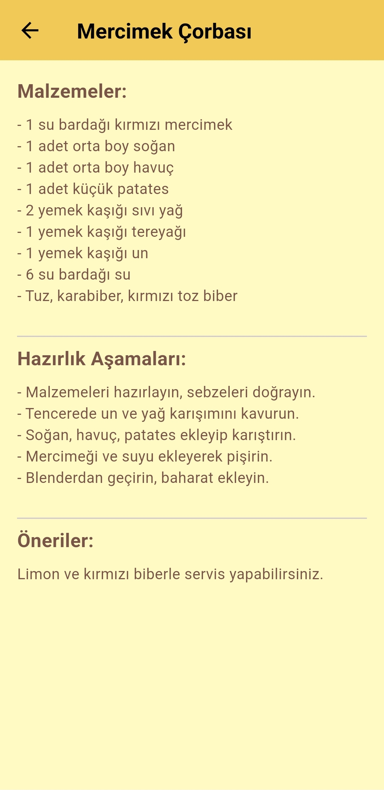
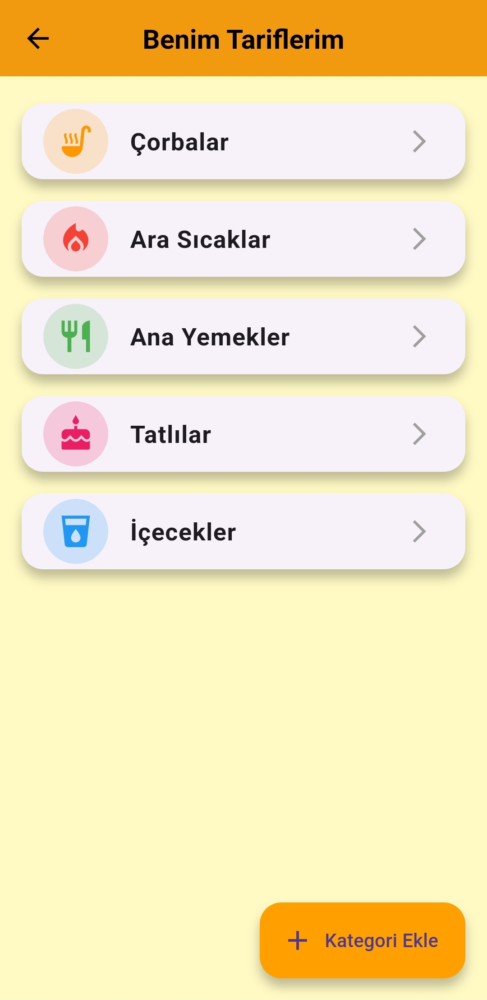
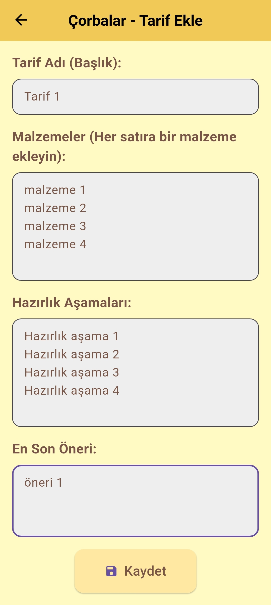
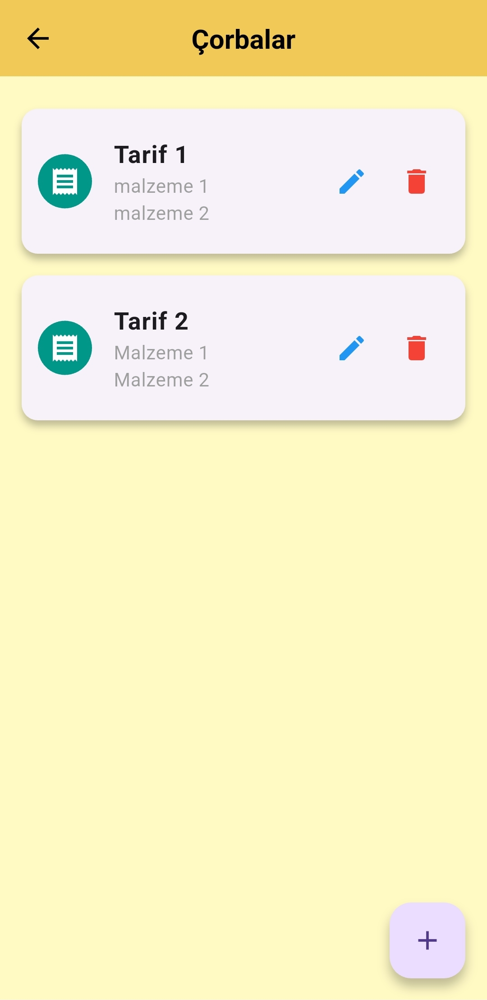
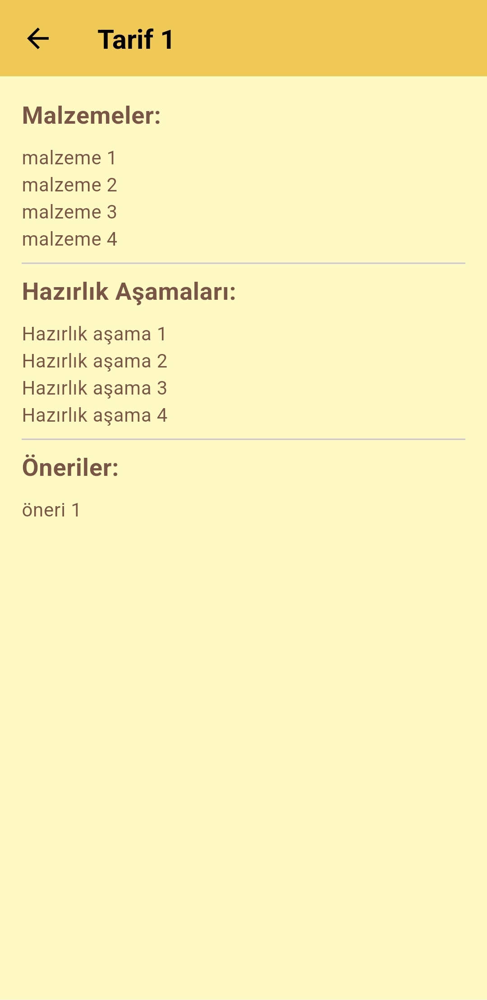
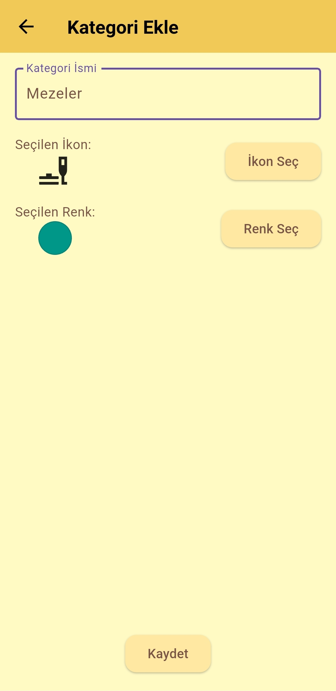
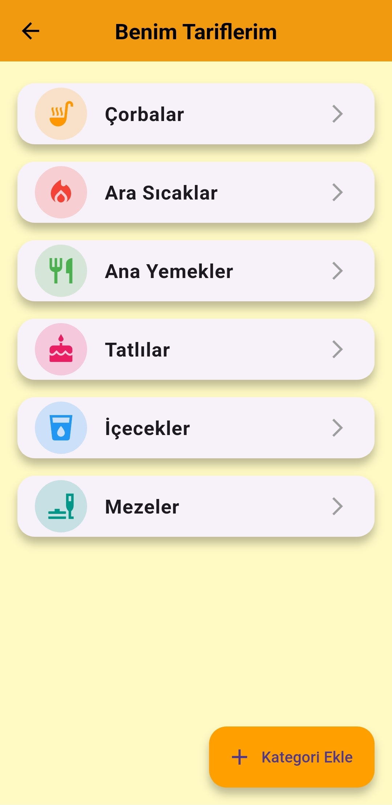

# Mutfak Defteri Mobil Uygulaması

## Hakkında
Mutfak Defteri, kullanıcıların yemek tariflerini kaydedip düzenleyebileceği bir mobil uygulamadır. Hazır tarifleri görüntüleme, kendi tariflerinizi ekleme, düzenleme ve silme gibi özellikleri destekler. Kullanıcı dostu arayüzü ve kategori bazlı organize yapısı ile tariflerinizi kolayca yönetmenizi sağlar.

## Özellikler
- **Hazır Tarifler**: Önceden tanımlanmış tariflere göz atabilirsiniz.
- **Tarif Ekleme**: Kendi tariflerinizi kategori bazlı ekleyebilirsiniz.
- **Tarif Düzenleme ve Silme**: Eklediğiniz tarifleri kolayca düzenleyip silebilirsiniz.
- **Kategori Yönetimi**: Yeni kategoriler oluşturabilir ve düzenleyebilirsiniz.

## Ekran Görüntüleri

### Ana Sayfa

Uygulamanın giriş ekranıdır. Hazır tariflere veya kullanıcı tariflerine erişim sağlayabilirsiniz.

### Hazır Tarifler

Bu ekran, uygulamanın sunduğu hazır tarifleri kategori bazlı listelemektedir.

### Çorba Kategorisi

Çorba kategorisine ait tariflerin listelendiği ekran.

### Tarif Detayı

Seçilen tarifin detaylarını, malzemelerini ve hazırlanış aşamalarını görüntüleyebilirsiniz.

### Benim Tariflerim

Kullanıcıların kendi ekledikleri tariflerin bulunduğu ekran.

### Tarif Ekle

Yeni bir tarif eklemek için kullanılacak ekran. Tarif adı, malzemeler ve hazırlık aşamaları eklenebilir.

### Tarif Listesi

Eklenmiş tariflerin listelendiği ekran. Tarifler üzerinde düzenleme ve silme işlemleri yapılabilir.

### Tarif Detayı (Kullanıcı Tarifi)

Kullanıcı tarafından eklenmiş bir tarifin detayları.

### Kategori Ekle

Yeni bir kategori oluşturmak için kullanılan ekran. Kategori adı, ikon ve renk seçimi yapılabilir.

### Güncellenmiş Kategoriler

Kullanıcı tarafından eklenen kategoriler ile birlikte liste.

## Teknolojiler
- **Flutter**: Uygulamanın geliştirilmesinde kullanılan framework.
- **Dart**: Programlama dili.
- **SQLite**: Veritabanı yönetimi için kullanılmıştır.

## Kurulum ve Kullanım
1. Bu projeyi [GitHub](#) reposundan klonlayın.
2. Flutter ve gerekli bağımlılıkların kurulu olduğundan emin olun.
3. `flutter pub get` komutunu çalıştırarak bağımlılıkları yükleyin.
4. Uygulamayı başlatmak için `flutter run` komutunu kullanın.

## Demo
Uygulamanın çalışma şeklini görmek için aşağıdaki YouTube bağlantısına tıklayın:  
[YouTube Demo](https://youtu.be/demo-link)

## Geliştiriciler
- **Geliştirici 1**: [GitHub](#)
- **Geliştirici 2**: [GitHub](#)

Her türlü geri bildirim ve önerileriniz için bizimle iletişime geçebilirsiniz!

## İletişim Bilgileri

**Geliştirici 1**  
*Ad*: Adil Baha  
*Soyad*: Şahin  
*e-mail*: adilbaha54@gmail.com  
*Tel No*: +905511748211  

**Geliştirici 2**  
*Ad*: Emirhan  
*Soyad*: Utaş  
*e-mail*: 132130034@ogr.uludag.edu.tr 
*Tel No*: +905345805434
